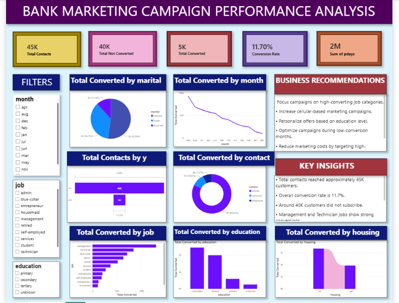

# FUTURE_DS_03

# Bank Marketing Campaign Performance Analysis Dashboard

## Internship Task

**Future Interns – Data Science & Analytics – Task 3**

---

## Project Objective

The objective of this project is to analyze a bank marketing campaign and evaluate customer conversion performance. The dashboard helps identify customer conversion trends, campaign effectiveness, and customer behavior. It provides valuable business insights that support better marketing decisions and improve future campaign performance.

---

## Tools Used

- Power BI
- Microsoft Excel
- Power Query
- DAX (Data Analysis Expressions)

---

## Dashboard Preview

### Bank Marketing Campaign Performance Analysis Dashboard

---

## Dashboard Analysis

The dashboard includes:

- KPI Cards
  - Total Contacts
  - Total Converted Customers
  - Total Not Converted Customers
  - Conversion Rate
- Monthly Conversion Trend
- Customer Conversion by Job
- Customer Conversion by Contact Type
- Customer Conversion by Marital Status
- Customer Conversion by Education
- Customer Conversion Funnel
- Interactive Filters
  - Month
  - Job
  - Education
- Key Insights
- Business Recommendations

---

## Key Insights

- Approximately 45K customers were contacted during the marketing campaign.
- Around 5K customers subscribed to the term deposit.
- The overall campaign conversion rate is 11.70%.
- Most contacted customers did not subscribe, indicating opportunities to improve campaign performance.
- Management and Technician job categories achieved higher conversion rates.
- Customers with Secondary and Tertiary education accounted for the highest number of successful subscriptions.
- Conversion performance varies across customer demographics and contact methods.
- Monthly trend analysis helps identify the most effective campaign periods.

---

## Business Recommendations

- Focus marketing efforts on customer segments with higher conversion rates.
- Personalize campaigns based on customer occupation and education.
- Improve campaign strategies during low-performing months.
- Optimize communication channels to increase customer responses.
- Use customer segmentation for targeted marketing campaigns.
- Monitor campaign performance regularly using interactive dashboards.

---

## Project Files

- Power BI Dashboard: `Bank_Marketing_Campaign_Performance_Analysis_Dashboard.pbix`
- Dashboard Screenshot: `Dashboard_Preview.png`

---

## Skills Gained

- Data Cleaning
- Data Transformation
- Power Query
- DAX Calculations
- KPI Development
- Marketing Analytics
- Customer Conversion Analysis
- Dashboard Design
- Business Intelligence
- Data Visualization
- Business Insight Generation

---

## Conclusion

This project provided practical experience in marketing analytics and customer conversion analysis using Power BI. The dashboard transforms campaign data into meaningful visual insights, enabling businesses to evaluate campaign performance, understand customer behavior, and make informed decisions to improve future marketing strategies.
